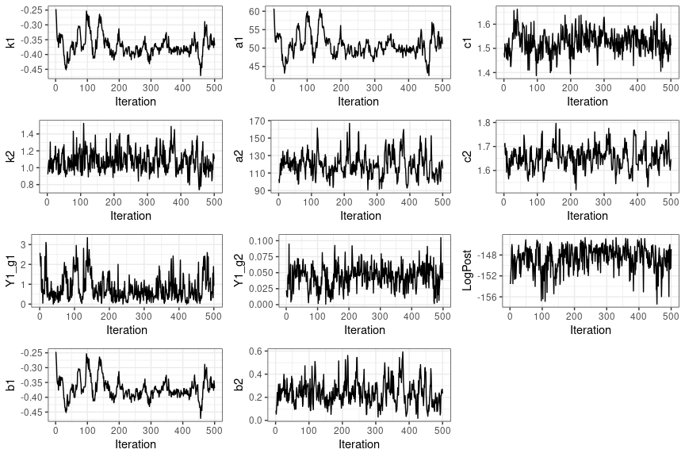
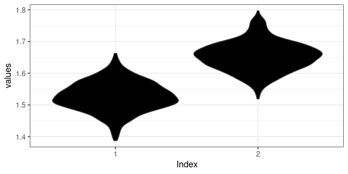

# RBaM - An R user interface to BaM <a href=""></a>

## Introduction

BaM (Bayesian Modeling) is a framework to estimate a model using
Bayesian inference. The R package `RBaM` is built as an R User Interface
to the [computational BaM engine](https://github.com/BaM-tools/BaM). It
defines classes (objects’ properties and methods) for the various
building blocks of a BaM case study. Its typical usage is as follows:

1.  Assemble the dataset of input/ouput variables.
2.  Define the model and set prior distributions for its parameters.
3.  Perform Bayesian-MCMC inference.
4.  Perform predictions.

``` r
# devtools::install_github('BaM-tools/RBaM') # First use: install the package from GitHub
library(RBaM) # Load package
```

The catalogue of distributions and models that are available in RBaM can
be accessed as follows:

``` r
getCatalogue()
```

    ## $distributions
    ##  [1] "Gaussian"     "Uniform"      "Triangle"     "LogNormal"    "LogNormal3"  
    ##  [6] "Exponential"  "GPD"          "Gumbel"       "GEV"          "GEV_min"     
    ## [11] "Inverse_Chi2" "PearsonIII"   "Geometric"    "Poisson"      "Bernoulli"   
    ## [16] "Binomial"     "NegBinomial"  "FlatPrior"    "FlatPrior+"   "FlatPrior-"  
    ## [21] "FIX"          "VAR"         
    ## 
    ## $models
    ##  [1] "TextFile"               "BaRatin"                "BaRatinBAC"            
    ##  [4] "SFD"                    "SGD"                    "SWOT"                  
    ##  [7] "Vegetation"             "AlgaeBiomass"           "DynamicVegetation"     
    ## [10] "Recession_h"            "Segmentation"           "Sediment"              
    ## [13] "SuspendedLoad"          "Linear"                 "Mixture"               
    ## [16] "Orthorectification"     "GR4J"                   "Tidal"                 
    ## [19] "SFDTidal"               "SFDTidal2"              "SFDTidalJones"         
    ## [22] "SFDTidal4"              "TidalODE"               "TidalRemenieras"       
    ## [25] "SFDTidal_Sw_correction" "MAGE"

## An example using the BaRatin rating curve model

A [rating curve](https://en.wikipedia.org/wiki/Rating_curve) is a model
linking the water stage $H$ measured at a given point of a river and the
discharge $Q$ flowing through it. The elementary rating curve equation
has the power-law form Q=a(H-b)<sup>c</sup>, where a, b and c are
parameters. Since different hydraulic controls may succeed to each other
as the water stage increases, it is frequent to use a piecewise
combination of these elementary equations, for instance:
Q=a<sub>1</sub>(H-b<sub>1</sub>)<sup>c<sub>1</sub></sup> for
k<sub>1</sub> \< H \< k<sub>2</sub>;
Q=a<sub>2</sub>(H-b<sub>2</sub>)<sup>c<sub>2</sub></sup> for H \>
k<sub>2</sub>, with k<sub>1</sub> and k<sub>2</sub> the activation
stages of the first and the second control. We refer to [this
article](https://hal.archives-ouvertes.fr/hal-00934237) for additional
details.

This example shows how to estimate a rating curve using a set of (H,Q)
calibration data (called ‘gaugings’) from the [Ardèche
river](https://en.wikipedia.org/wiki/Ardèche_(river)) at the
Sauze-Saint-Martin hydrometric station. The first thing to do is to
define the workspace, i.e. the folder where configuration and result
files will be written.

``` r
workspace=file.path(getwd(),'BaM_workspace')
```

The second step is to define the calibration data. The dataset
`SauzeGaugings` is provided with this package, and the code below let
RBaM know what to use as inputs/outputs.

``` r
# Define the calibration dataset by specifying 
# inputs (X), outputs (Y) and uncertainty on the outputs (Yu).
# A copy of this dataset will be written in data.dir.
D=dataset(X=SauzeGaugings['H'],Y=SauzeGaugings['Q'],Yu=SauzeGaugings['uQ'],data.dir=workspace)
```

The third step is to define the rating curve model. The code below
specifies the priors on parameters, the control matrix and creates the
model object.

``` r
# Parameters of the low flow section control: activation stage k, coefficient a and exponent c
k1=parameter(name='k1',init=-0.5,prior.dist='Uniform',prior.par=c(-1.5,0))
a1=parameter(name='a1',init=50,prior.dist='LogNormal',prior.par=c(log(50),1))
c1=parameter(name='c1',init=1.5,prior.dist='Gaussian',prior.par=c(1.5,0.05))
# Parameters of the high flow channel control: activation stage k, coefficient a and exponent c
k2=parameter(name='k2',init=1,prior.dist='Gaussian',prior.par=c(1,1))
a2=parameter(name='a2',init=100,prior.dist='LogNormal',prior.par=c(log(100),1))
c2=parameter(name='c2',init=1.67,prior.dist='Gaussian',prior.par=c(1.67,0.05))
# Define control matrix: columns are controls, rows are stage ranges.
# Here the matrix means that the first control only is active for the first stage range,
# and the second control only is active for the second stage range.
controlMatrix=rbind(c(1,0),c(0,1))
# Stitch it all together into a model object
M=model(ID='BaRatin',
        nX=1,nY=1, # number of input/output variables
        par=list(k1,a1,c1,k2,a2,c2), # list of model parameters
        xtra=xtraModelInfo(object=controlMatrix)) # use xtraModelInfo() to pass the control matrix
```

All set! The function BaM can now be called to estimate parameters. This
will run a MCMC sampler and save the result into the workspace.

``` r
BaM(mod=M,data=D)
```

MCMC samples can now be read. There are 2 MCMC files: ‘Results_MCMC.txt’
contains raw MCMC simulations and is hence quite big.
‘Results_Cooking.txt’ contains ‘cooked’ simulations, i.e. after
‘burning’ the first part of iterations and ‘slicing’ what remains, and
may be favored in most cases. Functions `mcmcOptions()` and
`mcmcCooking()` allow controlling MCMC properties.

``` r
# Read 'cooked' MCMC file in the workspace
MCMC=readMCMC(file.path(workspace,'Results_Cooking.txt'))
head(MCMC)
```

    ##          k1      a1      c1       k2       a2      c2    Y1_g1     Y1_g2
    ## 1 -0.246780 60.4238 1.48103 0.922899 102.8730 1.70117 2.582080 0.0224468
    ## 2 -0.269413 60.5724 1.46413 0.930665  99.0574 1.70117 2.232150 0.0131388
    ## 3 -0.291071 58.2851 1.51878 1.000870 105.3410 1.71316 1.904870 0.0157354
    ## 4 -0.327582 55.5986 1.50333 1.053400 108.8020 1.67034 2.385710 0.0118051
    ## 5 -0.346240 53.3239 1.50333 1.087950 120.9590 1.66413 0.756269 0.0414687
    ## 6 -0.353747 51.7361 1.49109 1.045050 110.3710 1.69349 0.590987 0.0467566
    ##    LogPost        b1        b2
    ## 1 -153.555 -0.246780 0.0845701
    ## 2 -152.904 -0.269413 0.0544618
    ## 3 -151.209 -0.291071 0.1125240
    ## 4 -150.324 -0.327582 0.1588370
    ## 5 -146.927 -0.346240 0.2412690
    ## 6 -145.997 -0.353747 0.1859880

A few functions are provided with the package to explore MCMC samples.

``` r
# Trace plot for each parameter, useful to assess convergence.
plots=tracePlot(MCMC)
gridExtra::grid.arrange(grobs=plots,ncol=3)
```

<!-- -->

``` r
# Density plot for each parameter
plots=densityPlot(MCMC)
gridExtra::grid.arrange(grobs=plots,ncol=3)
```

    ## Warning: The dot-dot notation (`..density..`) was deprecated in ggplot2 3.4.0.
    ## ℹ Please use `after_stat(density)` instead.
    ## ℹ The deprecated feature was likely used in the RBaM package.
    ##   Please report the issue to the authors.
    ## This warning is displayed once every 8 hours.
    ## Call `lifecycle::last_lifecycle_warnings()` to see where this warning was
    ## generated.

<!-- -->

``` r
# Violon plot, useful to compare 'comparable' parameters.
violinPlot(MCMC[c('c1','c2')])
```

<!-- -->

Finally, the estimated rating curve model can be used to make
predictions as shown below.

``` r
# Define the grid of stage values on which the rating curve will be computed
hgrid=data.frame(H=seq(-1,7,0.1))
# Define a 'prediction' object for total predictive uncertainty
totalU=prediction(X=hgrid, # stage values
                  spagFiles='totalU.spag', # file where predictions are saved
                  data.dir=workspace, # a copy of data files will be saved here
                  doParametric=TRUE, # propagate parametric uncertainty, i.e. MCMC samples?
                  doStructural=TRUE) # propagate structural uncertainty ?
# Define a 'prediction' object for parametric uncertainty only - not the doStructural=FALSE
paramU=prediction(X=hgrid,spagFiles='paramU.spag',data.dir=workspace,
                  doParametric=TRUE,doStructural=FALSE)
# Define a 'prediction' object with no uncertainty - this corresponds to the 'maxpost' rating curve maximizing the posterior
maxpost=prediction(X=hgrid,spagFiles='maxpost.spag',data.dir=workspace,
                  doParametric=FALSE,doStructural=FALSE)
# Re-run BaM, but in prediction mode
BaM(mod=M,data=D, # model and data
    pred=list(totalU,paramU,maxpost), # list of predictions
    doCalib=FALSE,doPred=TRUE) # Do not re-calibrate but do predictions
```

The resulting ‘spaghetti files’ can be read into the workspace and
plotted.

``` r
# Plot spaghetti representing total uncertainty in red
Q=read.table(file.path(workspace,'totalU.spag'))
matplot(hgrid$H,Q,col='red',type='l',lty=1)
# Add spaghetti representing parametric uncertainty in pink
Q=read.table(file.path(workspace,'paramU.spag'))
matplot(hgrid$H,Q,col='pink',type='l',lty=1,add=TRUE)
# Add maxpost rating curve
Q=read.table(file.path(workspace,'maxpost.spag'))
matplot(hgrid$H,Q,col='black',type='l',lty=1,add=TRUE)
```

<!-- -->

Spaghetti are the raw outputs of the predictions, but it is often more
convenient to plot probability intervals only. These have been computed
automatically by BaM, and are saved in files with an ‘.env’ (like
‘envelop’) extension.

``` r
Q=read.table(file.path(workspace,'totalU.env'),header=T)
matplot(hgrid$H,Q[,2:3],col='red',type='l',lty=1)
Q=read.table(file.path(workspace,'paramU.env'),header=T)
matplot(hgrid$H,Q[,2:3],col='pink',type='l',lty=1,add=TRUE)
Q=read.table(file.path(workspace,'maxpost.spag'))
matplot(hgrid$H,Q,col='black',type='l',lty=1,add=TRUE)
```

<!-- -->
